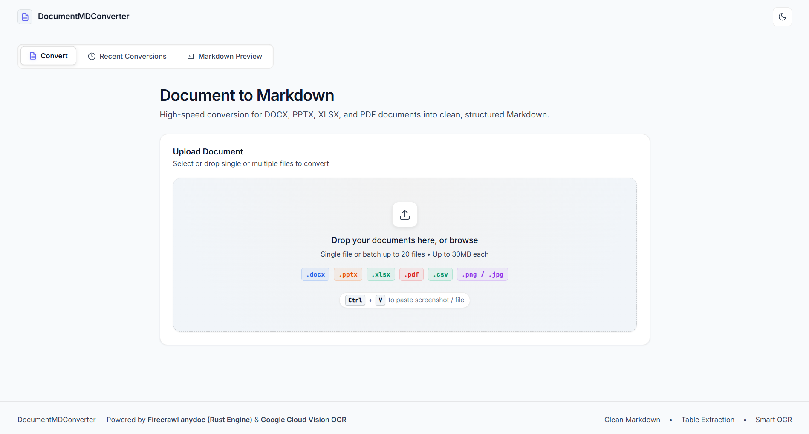
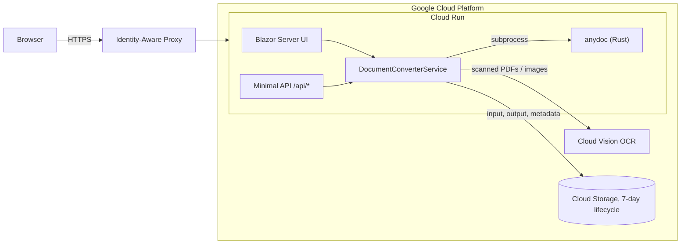
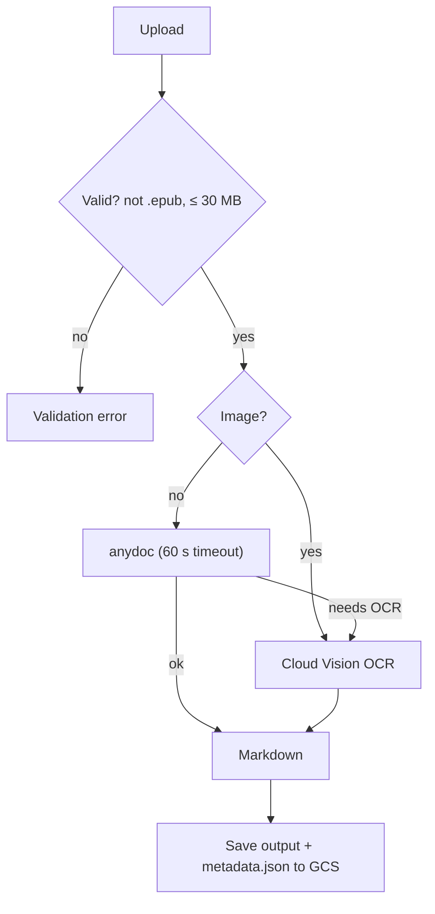

<div align="center">

# 📄 DocumentMDConverter

**Turn Word, PowerPoint, Excel, PDF and images into clean, LLM-ready Markdown.**


-DEA584?logo=rust&logoColor=white)



</div>

## ✨ Highlights

- ⚡ **Fast and cheap:** conversion runs on [`anydoc`](https://github.com/firecrawl/anydoc), a native Rust engine, so there is no per-document API cost.
- 🔍 **Smart OCR fallback:** scanned PDFs and images go to Google Cloud Vision automatically, only when needed.
- 📥 **Easy input:** drag & drop, file picker, `Ctrl+V` paste, batches of up to 20 files (30 MB each).
- 🕘 **History:** search, filter, multi-select and ZIP download. Items expire after 7 days.
- 📝 **Live Markdown editor** with split view and Mermaid diagrams.
- 🌗 **Light and dark themes.**
- ☁️ **Serverless:** one container on Cloud Run, no database, Terraform included.

## 🦀 Powered by anydoc

[**anydoc**](https://github.com/firecrawl/anydoc) by Firecrawl is the core of this project. It is a Rust CLI that converts office documents and PDFs to Markdown without any external service.

- Handles `.docx`, `.pptx`, `.xlsx`, `.csv`, `.pdf` and more, keeping headings, lists and tables (GFM).
- Runs as a local subprocess: no network calls and no cost per page.
- Detects scanned PDFs (exit code `3`) so the app can hand them to Cloud Vision OCR.
- Distributed on npm (`@firecrawl/anydoc`). The Docker image installs it globally. Locally it is fetched with `npx` if no binary is configured.

Many thanks to the Firecrawl team for building it. 🙌

## 🧭 Supported formats

| Input | Engine | Output |
| :--- | :--- | :--- |
| `.docx` `.doc` `.odt` `.rtf` | **anydoc** | Headings, lists, emphasis |
| `.xlsx` `.xls` `.csv` `.ods` | **anydoc** | GFM tables |
| `.pptx` `.ppt` | **anydoc** | Slide Markdown |
| `.pdf` with text | **anydoc** | Paragraphs, headings, tables |
| `.pdf` scanned | anydoc detects it → **Cloud Vision OCR** | One `## Page N` section per page |
| `.png` `.jpg` `.jpeg` `.webp` | **Cloud Vision OCR** | OCR text |

`.epub` is rejected.

## 🏗️ Architecture

One .NET 10 monolith (Blazor Server + Minimal APIs) in a single Cloud Run container. Google Cloud Storage holds files, outputs and history metadata; a lifecycle rule purges everything after 7 days.



Clean Architecture layers: `Domain` → `Application` → `Infrastructure` → `Web`, under `src/`.

### Conversion flow



Storage failures are non-fatal: the Markdown is still returned, it just will not appear in history.

## 🚀 Quick start

Requirements: [.NET 10 SDK](https://dotnet.microsoft.com/) and [Node.js 20+](https://nodejs.org/) (for `anydoc` via `npx`). Cloud Vision and Cloud Storage need `gcloud auth application-default login`, but plain conversions work without them.

```bash
dotnet run --project src/DocumentMDConverter.Web/DocumentMDConverter.Web.csproj
```

Open `http://localhost:5070`. To enable history locally, copy `appsettings.Example.json` to `appsettings.Local.json` (git-ignored) and set your bucket.

## 🔌 REST API

| Method | Route | Description |
| :--- | :--- | :--- |
| `POST` | `/api/documents/convert` | Multipart `file`, optional `enableOcrFallback`. Returns the conversion result. |
| `GET` | `/api/history` | The current user's history. |
| `GET` | `/api/history/download?path=` | `302` to a 1-hour signed URL. |
| `GET` | `/api/history/markdown-content?path=` | Markdown of a stored result. |
| `POST` | `/api/batch/zip` | ZIP of several results. |
| `GET` | `/api/health` | Health probe. |

```bash
curl -X POST http://localhost:5070/api/documents/convert -F "file=@report.docx" -F "enableOcrFallback=true"
```

## ⚙️ Configuration

| Setting | Purpose |
| :--- | :--- |
| `GCS_TEMP_BUCKET` | Enables Cloud Storage and history. Without it, conversions work but nothing is stored. |
| `ANYDOC_BIN_PATH` | Path to the `anydoc` binary. Falls back to `/usr/bin/anydoc`, then `npx @firecrawl/anydoc`. |
| `Iap:DefaultDevUserEmail` | Identity used locally when there is no IAP header. |

## 🐳 Docker and deployment

```bash
docker build -f src/DocumentMDConverter.Web/Dockerfile -t document-md-converter .
```

The image installs Node.js and `@firecrawl/anydoc`. Infrastructure (Cloud Run, Storage, IAM, Artifact Registry) is Terraform in [`infra/`](infra/README.md), which also covers the release procedure.

## ⚠️ Known limitations

- Limits: 30 MB per upload, 20 files per batch (processed sequentially). Vision OCR for PDFs: ≤ 10 MB and ≤ 5 pages.
- ZIP files are built in memory.
- The history download endpoints do not check that `path` belongs to the caller. They rely on IAP and unguessable job IDs, so add a `users/<caller>/` prefix check before wider exposure.
- Mermaid loads from a CDN, so offline environments show the diagram source.

## 📚 Documentation

- [`specs/ARCHITECTURE.md`](specs/ARCHITECTURE.md): technical architecture, storage schema, sequence diagrams
- [`specs/UI_UX_SPEC.md`](specs/UI_UX_SPEC.md): design system and component behavior
- [`specs/IMPLEMENTATION_PLAN.md`](specs/IMPLEMENTATION_PLAN.md): phases and acceptance criteria
- [`infra/README.md`](infra/README.md): Terraform, IAM and release procedure