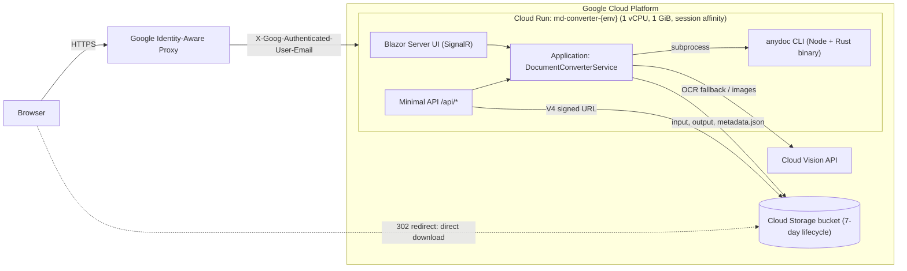
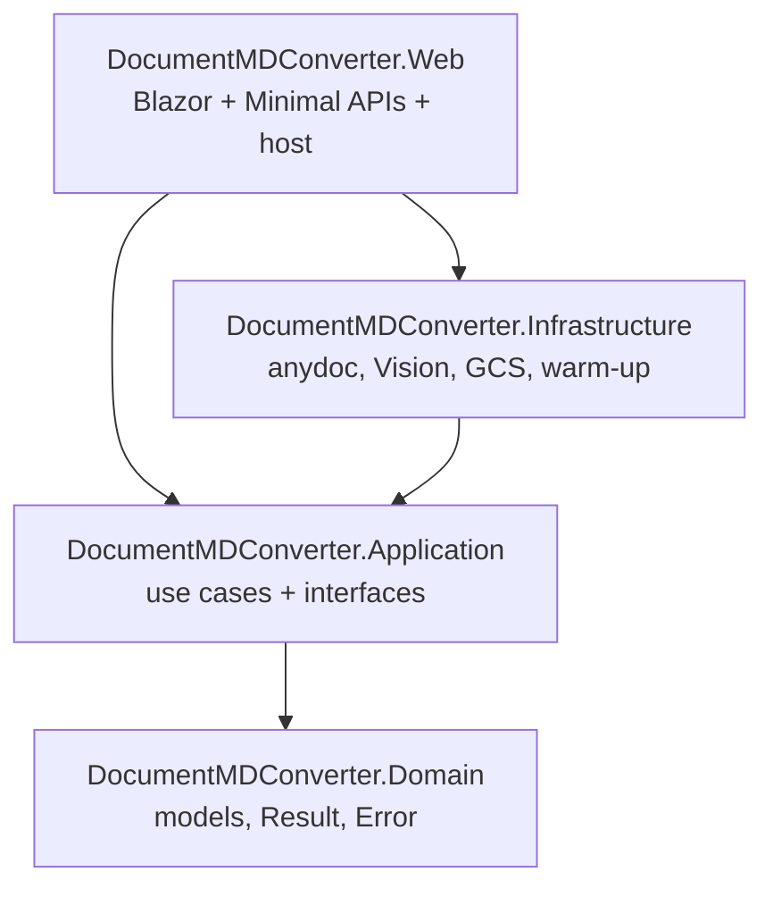
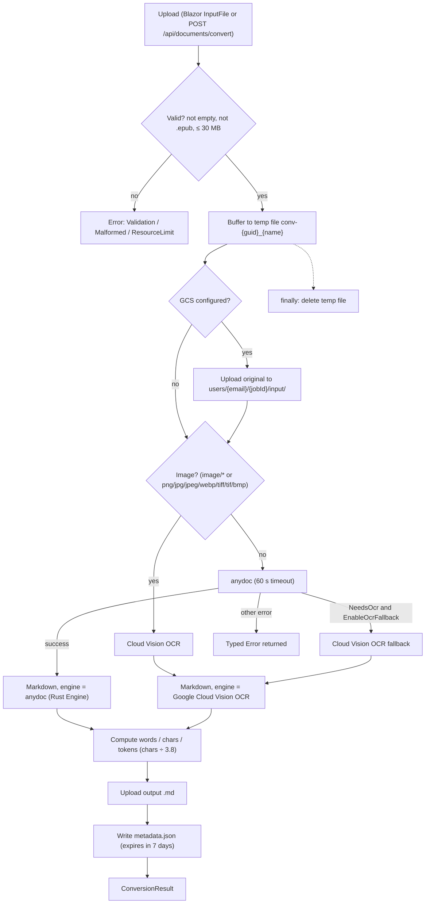
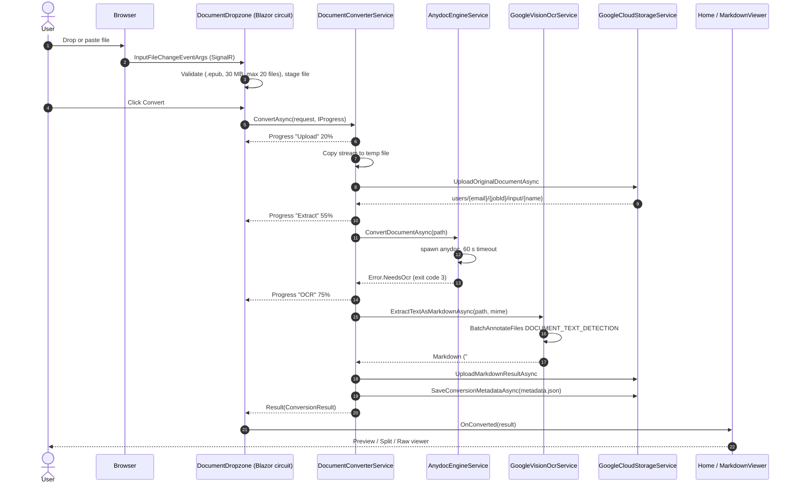
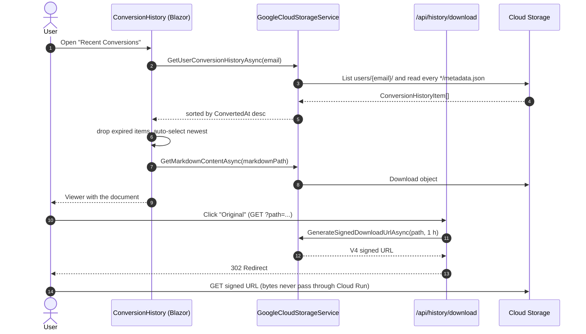
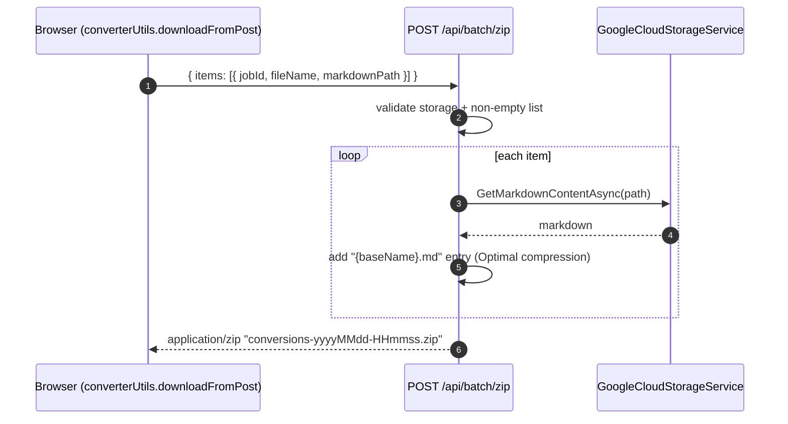
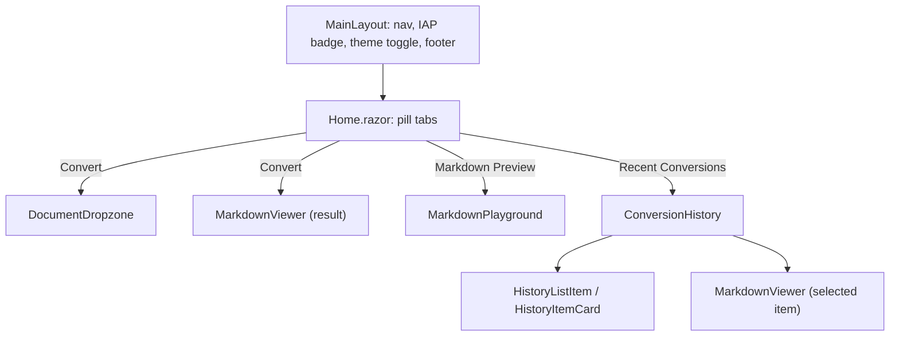
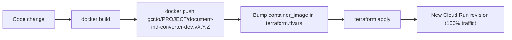

# DocumentMDConverter


> Converts enterprise documents (Word, PowerPoint, Excel/CSV, PDF and images) into **clean, structured Markdown (GFM)** optimized for LLMs (Gemini, Claude, GPT) and human review.
>
> Hybrid engine: **`anydoc`** (native Rust CLI, $0 compute) with automatic fallback to **Google Cloud Vision OCR** for scanned PDFs and images.


**Highlights:** drag & drop or `Ctrl+V` paste · batch up to 20 files · conversion history with search and ZIP download · live Markdown editor with Mermaid · light/dark theme · deployed on Cloud Run behind Google IAP (URL: `terraform output web_url`).

**Quick start:** `cd src/DocumentMDConverter.Web && dotnet run` (see [Local development](#10-local-development)).
---

---

## Table of contents

1. [What it does](#1-what-it-does)
2. [Architecture at a glance](#2-architecture-at-a-glance)
3. [Solution layout](#3-solution-layout)
4. [How a conversion works](#4-how-a-conversion-works)
5. [Features](#5-features)
6. [Storage, history and privacy](#6-storage-history-and-privacy)
7. [Authentication (IAP)](#7-authentication-iap)
8. [REST API](#8-rest-api)
9. [Configuration](#9-configuration)
10. [Local development](#10-local-development)
11. [Docker image](#11-docker-image)
12. [Deployment and release](#12-deployment-and-release)
13. [Limits and known limitations](#13-limits-and-known-limitations)
14. [Further documentation](#14-further-documentation)

---

## 1. What it does

| Input | Handled by | Output |
| :--- | :--- | :--- |
| `.docx` `.doc` `.odt` `.rtf` | `anydoc` | Markdown with headings, lists, emphasis |
| `.xlsx` `.xls` `.csv` `.ods` | `anydoc` | GFM tables |
| `.pptx` `.ppt` | `anydoc` | Slide Markdown |
| `.pdf` with selectable text | `anydoc` | Paragraphs, headings, tables |
| `.pdf` scanned (no text layer) | `anydoc` detects it → **Cloud Vision OCR** | OCR text, one `## Page N` section per page |
| `.png` `.jpg` `.jpeg` `.webp` (`.tiff` `.tif` `.bmp` by extension) | **Cloud Vision OCR** directly | OCR text |

`.epub` is rejected. Max upload: **30 MB** per file, **20 files** per batch.

The UI also includes a standalone **Markdown Preview** tab (live editor + rendered preview with Mermaid diagram support).

---

## 2. Architecture at a glance

One .NET 10 monolith (Blazor Server + Minimal APIs) in a single container on **Cloud Run**. There is no database: Google Cloud Storage holds files, outputs and history metadata, and a lifecycle rule purges everything after 7 days.



Key decisions:

* **Monolith, in-process:** the Blazor UI calls `IDocumentConverterService` directly over SignalR; no internal HTTP hop.
* **Two-stage conversion:** cheap local engine first, paid OCR only when needed (1,000 pages/month are free in GCP).
* **Serverless persistence:** GCS only. History = `metadata.json` objects under a per-user prefix.
* **Zero-RAM downloads:** the server redirects to a short-lived V4 signed URL instead of streaming bytes.
* **Session affinity** is required so a Blazor circuit stays pinned to one Cloud Run instance.

---

## 3. Solution layout

Clean Architecture, .NET 10 / C# latest, Central Package Management, `TreatWarningsAsErrors` + `AnalysisMode=All` in every project (`Directory.Build.props`).



```text
.
├── DocumentMDConverter.slnx
├── Directory.Build.props / Directory.Packages.props / .editorconfig
├── specs/                         # ARCHITECTURE, UI_UX_SPEC, IMPLEMENTATION_PLAN
├── infra/                         # Terraform (modules + dev/prod environments)
└── src/
    ├── DocumentMDConverter.Domain/
    │   ├── Common/                # Result<T>, Error (typed discriminated union)
    │   └── Models/                # ConversionRequest/Result/Progress/HistoryItem, FormatUtils
    ├── DocumentMDConverter.Application/
    │   ├── Interfaces/            # IDocumentConverterService, IAnydocEngineService,
    │   │                          # IGoogleVisionOcrService, ICloudStorageService,
    │   │                          # IMarkdownRendererService, IUserContextService
    │   └── Services/              # DocumentConverterService (orchestrator), MarkdownRendererService (Markdig)
    ├── DocumentMDConverter.Infrastructure/
    │   ├── Engines/               # AnydocEngineService, GoogleVisionOcrService
    │   ├── Storage/               # GoogleCloudStorageService
    │   └── Warmup/                # AnydocWarmupBackgroundService
    └── DocumentMDConverter.Web/
        ├── Components/            # Layout, Pages/Home, Shared/* (see §5)
        ├── Endpoints/             # one IEndpoint class per route group, auto-registered
        ├── Infrastructure/        # CustomResults: Error → RFC 7807 ProblemDetails
        ├── Services/              # UserContextService (IAP identity)
        ├── wwwroot/               # modern-converter.css (themes), js/converter.js
        └── Dockerfile
```

| Layer | Responsibilities |
| :--- | :--- |
| **Domain** | Pure records and the `Result<T>` / `Error` types. `Error` is a record hierarchy (`NeedsOcr`, `DocumentProtected`, `ResourceLimit`, `Malformed`, `TimedOut`, `Validation`, `NotFound`, `Failure`) with cached singleton instances to avoid allocations. |
| **Application** | `DocumentConverterService` orchestrates temp file → upload original → engine → optional OCR → upload output → save metadata. Depends only on interfaces. |
| **Infrastructure** | Adapters: subprocess `anydoc`, Cloud Vision SDK, Cloud Storage SDK, warm-up hosted service. All registered as singletons. |
| **Web** | Blazor Server components, endpoint classes discovered via reflection (`IEndpoint`), IAP identity, error mapping. |

---

## 4. How a conversion works

### 4.1 Orchestration flow



Storage failures are **non-fatal**: they are logged and the conversion still returns its Markdown (it just will not appear in history).

### 4.2 Sequence: interactive conversion (Blazor, scanned PDF fallback)



### 4.3 Sequence: history and downloads



### 4.4 Sequence: ZIP download (batch or history selection)



### 4.5 Error mapping

`CustomResults.Problem(Error)` converts domain errors into RFC 7807 responses.

| Error | `ErrorType` | HTTP | Typical cause |
| :--- | :--- | :--- | :--- |
| `Validation`, `Malformed`, `DocumentProtected`, `ResourceLimit` | Validation / Problem | 400 | Empty file, `.epub`, >30 MB, encrypted, corrupt |
| `NotFound` | NotFound | 404 | Missing storage object |
| `NeedsOcr` | Unprocessable | 422 | Scanned PDF with fallback disabled |
| `TimedOut` | Timeout | 504 | `anydoc` exceeded 60 s |
| `Failure` (default) | Failure | 500 | Anything else (message hidden: "An unexpected error occurred") |

### 4.6 `anydoc` execution details

* Binary resolution order: `ANYDOC_BIN_PATH` → `/usr/bin/anydoc` → `/usr/local/bin/anydoc` → `npx -y @firecrawl/anydoc@latest` (`cmd.exe /c npx …` on Windows).
* Exit code `3` or "need OCR" in stderr ⇒ `Error.NeedsOcr`. Other stderr patterns map to `DocumentProtected` (Encrypted), `ResourceLimit`, `Malformed`; `MissingPart` / `Unsupported` get friendly messages.
* 60 s timeout; on timeout or cancellation the whole process tree is killed.
* `AnydocWarmupBackgroundService` runs `anydoc --version` ~1.5 s after startup (30 s cap) to remove first-request latency. Failures are non-fatal.

### 4.7 Cloud Vision details

* PDFs: inline `BatchAnnotateFiles` with `DOCUMENT_TEXT_DETECTION`; **max 10 MB** and Vision's **5-page** inline limit. Output: `## Page N` sections.
* Images: `DetectDocumentTextAsync`; **max 20 MB**.
* Page → block → paragraph → word → symbol hierarchy is flattened to paragraphs separated by blank lines; detected breaks become spaces, newlines or hyphens.
* Credentials: Application Default Credentials (Cloud Run service account in production, `gcloud auth application-default login` locally).

---

## 5. Features

### UI (Blazor Server, `InteractiveServer`)



* **Convert tab** – `DocumentDropzone`: drag & drop anywhere on the page, file picker, **clipboard paste of images/files** (`converterUtils.initGlobalDropzone`). One file is staged then converted; multiple files (up to 20) become a **batch processed sequentially** with per-item status, per-item view/download and **ZIP download**. A 3-step progress pipeline (Upload → Extract/OCR → Format) is driven by `IProgress<ConversionProgress>`.
* **`MarkdownViewer`** – modes **Preview** (Markdig HTML), **Split** (resizable editor ‖ preview) and **Raw** (read-only code view with line numbers); copy to clipboard, download `.md`, download original (history), metadata pills (engine, duration, words, ~tokens), batch tabs.
* **Markdown Preview tab** – `MarkdownPlayground`: paste/write Markdown, live preview, raw HTML disabled, resizable split, synchronized line numbers, **Mermaid** diagrams (loaded from CDN, `securityLevel: strict`, theme-aware).
* **Recent Conversions tab** – `ConversionHistory`: search, format filter pills (ALL/PDF/PPTX/DOCX/XLSX/IMG…), multi-select + ZIP, auto-select newest, master–detail layout on desktop (≥ 992 px) and drill-down on mobile.
* **Theming** – dark/light via CSS variables, persisted in `localStorage["mdai-theme"]`, applied before first paint (inline script in `App.razor`).
* **Resilience** – `ReconnectModal` for dropped SignalR circuits; SignalR message limit raised to 35 MB for uploads.

### Rendering pipeline

`MarkdownRendererService` (Markdig: advanced extensions + Bootstrap) → HTML injected into the preview container → `converterUtils.renderMermaid` converts ` ```mermaid ` blocks client-side. In the playground the preview HTML is written from JavaScript (`converterUtils.setHtml`) so Blazor does not own nodes that Mermaid mutates.

---

## 6. Storage, history and privacy

```text
gs://<bucket>/users/<sanitized-email>/<jobId>/
├── input/<original file name>
├── output/<base name>.md
└── metadata.json               # ConversionHistoryItem (metrics, engine, paths, expiry)
```

* `jobId = conv-{guid:N}`; email is lower-cased, `accounts.google.com:` stripped, `/ \ :` replaced by `_`; missing email ⇒ `anonymous`.
* **No database.** History = list `users/<email>/` and read each `metadata.json`.
* **7-day retention:** `ExpiresAt = ConvertedAt + 7 days` in metadata, plus a bucket lifecycle rule (`age = 7 → Delete`) and soft-delete disabled.
* Bucket: uniform bucket-level access, private; the service account has `roles/storage.objectAdmin` on it only.
* The bucket name comes from `GCS_TEMP_BUCKET`. **If unset, storage features are disabled** (conversion still works, history is empty).

---

## 7. Authentication (IAP)

`UserContextService` resolves the user in this order:

1. Header `X-Goog-Authenticated-User-Email` (set by IAP), prefix `accounts.google.com:` removed.
2. `HttpContext.User.Identity.Name` if authenticated.
3. Config `Iap:DefaultDevUserEmail`, else `local.development@example.com` (local dev fallback).

Access control is enforced **by infrastructure**: when `iap_authorized_domains` is non-empty Terraform enables IAP on the Cloud Run service and grants `roles/iap.httpsResourceAccessor` to those members (plus `roles/run.invoker` to the IAP service agent). The app itself trusts the header and does no extra authorization.

---

## 8. REST API

All routes are discovered automatically: any class implementing `IEndpoint` in the Web assembly is registered.

| Method | Route | Description |
| :--- | :--- | :--- |
| `POST` | `/api/documents/convert` | Multipart: `file`, optional `enableOcrFallback` (bool), `format` (override passed to `anydoc --format`). Returns `ConversionResult` JSON. Antiforgery disabled. |
| `GET` | `/api/history` | Current user's non-purged history (`ConversionHistoryItem[]`; empty if storage not configured). |
| `GET` | `/api/history/download?path=<object path>` | `302` to a 1-hour V4 signed URL. |
| `GET` | `/api/history/markdown-content?path=<object path>` | `{ "markdown": "..." }`. |
| `POST` | `/api/batch/zip` | Body `{ "items": [{ "jobId", "fileName", "markdownPath" }] }` → `application/zip`. |
| `GET` | `/api/health` | Liveness/startup probe: `{ status, service, version, timestamp }`. |

```bash
# Convert (note: the route is /api/documents/convert)
curl -X POST http://localhost:5070/api/documents/convert \
  -F "file=@report.docx" -F "enableOcrFallback=true"

# History
curl http://localhost:5070/api/history

# Signed download redirect
curl -I "http://localhost:5070/api/history/download?path=users%2Fuser%40example.com%2Fconv-123%2Foutput%2Freport.md"

# Health
curl http://localhost:5070/api/health
```

---

## 9. Configuration

| Setting | Source | Purpose |
| :--- | :--- | :--- |
| `GCS_TEMP_BUCKET` | env var / config (also `GoogleCloud:BucketName`, `Storage:BucketName`) | Enables Cloud Storage and history. |
| `ANYDOC_BIN_PATH` | env var / config | Path of the `anydoc` binary (set to `/usr/bin/anydoc` in the image). |
| `Iap:DefaultDevUserEmail` | config | Identity used when no IAP header exists (local). |
| `appsettings.Local.json` | untracked file | Per-developer overrides (project id, bucket, dev identity). Copy `appsettings.Example.json`; it is git-ignored and excluded from the Docker context. |
| `GCP_PROJECT_ID` | env var (set by Terraform) | Informational. |
| `ASPNETCORE_URLS`, `PORT` | env var | `http://+:8080` / `8080` in the image (Cloud Run). |
| `ASPNETCORE_ENVIRONMENT` | env var | `Production` on Cloud Run. HTTPS redirection + HSTS only outside Development. |

Kestrel and form limits are 35 MB (for a 30 MB payload); the SignalR hub receive limit is also 35 MB.

---

## 10. Local development

### Prerequisites

1. [.NET 10 SDK](https://dotnet.microsoft.com/)
2. [Node.js 20+](https://nodejs.org/) – `anydoc` is fetched via `npx` when no binary is configured
3. Google Cloud SDK with ADC (`gcloud auth application-default login`) – required only for Cloud Vision and Cloud Storage

### Run

```bash
dotnet restore DocumentMDConverter.slnx
dotnet build DocumentMDConverter.slnx          # warnings are errors
dotnet run --project src/DocumentMDConverter.Web/DocumentMDConverter.Web.csproj
```

Default URLs (`launchSettings.json`): `http://localhost:5070` and `https://localhost:7038`.

To exercise history locally, set a bucket you can access, e.g. `GCS_TEMP_BUCKET=<bucket>` (put it in the untracked `appsettings.Local.json`, see `appsettings.Example.json`). Without it, conversions work but nothing is stored.

---

## 11. Docker image

Multi-stage `src/DocumentMDConverter.Web/Dockerfile` (build context = repository root):

1. **build** – `dotnet/sdk:10.0`, restore with project files first for layer caching, `dotnet publish -c Release`.
2. **runtime** – `dotnet/aspnet:10.0` + Node.js 20 + `npm i -g @firecrawl/anydoc`; `ANYDOC_BIN_PATH=/usr/bin/anydoc`, listens on `8080`.

```bash
docker build -f src/DocumentMDConverter.Web/Dockerfile -t gcr.io/<project>/document-md-converter-dev:v0.0.1 .
```

---

## 12. Deployment and release

Infrastructure is Terraform in [`infra/`](infra/README.md). Cloud Run runs 1 vCPU / 1 GiB, `session_affinity = true`, startup and liveness probes on `/api/health`, scale-to-zero by default.



### Release a new version (DEV)

```powershell
$v = "v0.0.69"                                   # next version
$img = "gcr.io/<project>/document-md-converter-dev:$v"

docker build -f src/DocumentMDConverter.Web/Dockerfile -t $img .
docker push $img

# edit infra/environments/dev/terraform.tfvars  ->  container_image = ""
cd infra/environments/dev
terraform apply -auto-approve
```

`terraform.tfvars` is the source of truth for the deployed version; `terraform.tfvars.example` shows the expected shape. Roll back by setting the previous tag and applying again.

---

## 13. Limits and known limitations

* **Sizes:** 30 MB upload; Vision OCR PDFs ≤ 10 MB and ≤ 5 pages; Vision images ≤ 20 MB; `anydoc` 60 s timeout.
* **Batch:** up to 20 files, processed one after another (not in parallel).
* **ZIP:** built in memory before being returned; very large selections consume RAM (instance limit is 1 GiB).
* **History listing** reads every `metadata.json` of the user on each load (no index).
* **Authorization of object paths:** `/api/history/download` and `/api/history/markdown-content` accept an arbitrary object `path` and do not verify it belongs to the caller; isolation relies on IAP restricting who can reach the app and on unguessable `jobId`s. Add a `users/<caller>/` prefix check before exposing the app more broadly.
* Mermaid is loaded from `cdn.jsdelivr.net` at runtime; offline environments will show the source instead of diagrams.
* Prod Terraform does not yet wire IAP variables (`iap_authorized_domains`) – see [`infra/README.md`](infra/README.md).

---

## 14. Further documentation

* [`specs/ARCHITECTURE.md`](specs/ARCHITECTURE.md) – deep technical architecture, storage schema, sequence diagrams.
* [`specs/UI_UX_SPEC.md`](specs/UI_UX_SPEC.md) – design system, layouts, component behavior.
* [`specs/IMPLEMENTATION_PLAN.md`](specs/IMPLEMENTATION_PLAN.md) – phases and acceptance criteria.
* [`infra/README.md`](infra/README.md) – GCP APIs, IAM, Terraform modules and release procedure.
