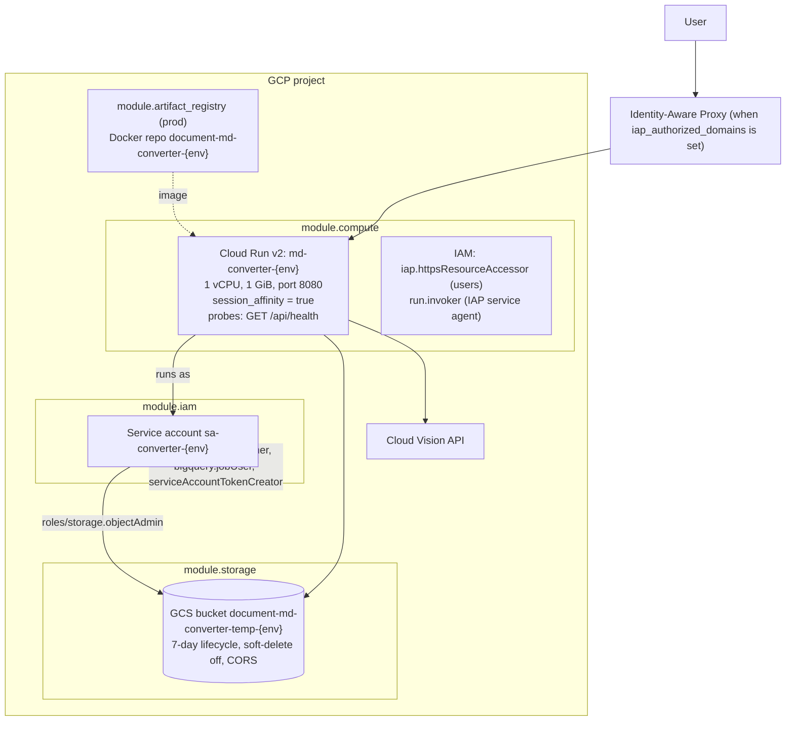
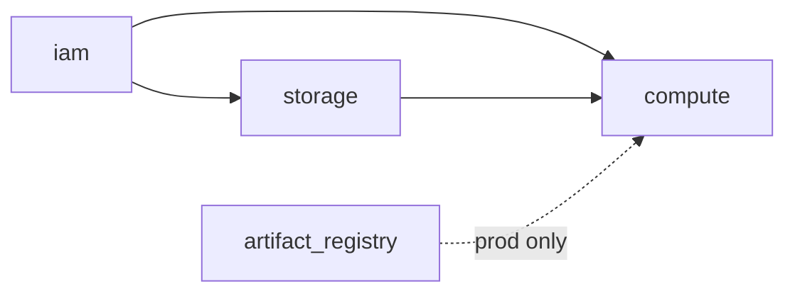
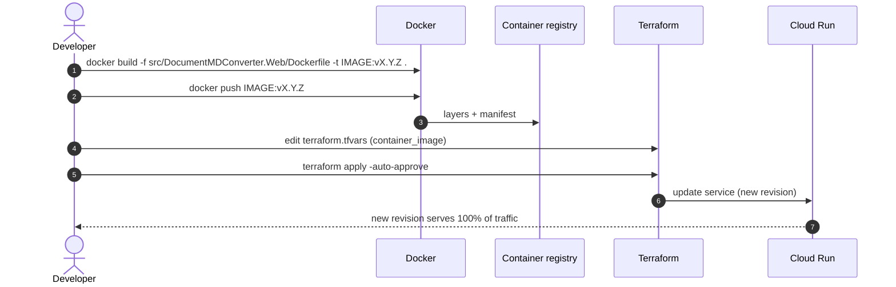

# Infrastructure (Terraform on GCP)

Serverless Infrastructure as Code for **DocumentMDConverter**, organized as reusable modules and two environments (`dev`, `prod`).

---

## 1. Topology



### Module dependency order



---

## 2. Required Google Cloud APIs

| API | Identifier | Used for |
| :--- | :--- | :--- |
| Cloud Run | `run.googleapis.com` | Hosting the Blazor app and API |
| Cloud Vision | `vision.googleapis.com` | OCR for scanned PDFs and images |
| Cloud Storage | `storage.googleapis.com` | Uploads, outputs, history metadata |
| Artifact Registry | `artifactregistry.googleapis.com` | Private Docker repository |
| Cloud Build | `cloudbuild.googleapis.com` | Optional in-cloud builds |
| IAM | `iam.googleapis.com` | Service accounts |
| IAM Credentials | `iamcredentials.googleapis.com` | Signing V4 URLs without key files |
| Resource Manager | `cloudresourcemanager.googleapis.com` | IAM policy bindings |
| BigQuery | `bigquery.googleapis.com` | Job tracking (`roles/bigquery.jobUser`) |
| Cloud IAP | `iap.googleapis.com` | Identity-Aware Proxy for Cloud Run |

```bash
gcloud services enable \
  run.googleapis.com vision.googleapis.com storage.googleapis.com \
  artifactregistry.googleapis.com cloudbuild.googleapis.com iam.googleapis.com \
  iamcredentials.googleapis.com cloudresourcemanager.googleapis.com \
  bigquery.googleapis.com iap.googleapis.com \
  --project=YOUR_GCP_PROJECT_ID
```

---

## 3. Layout

```text
infra/
├── modules/
│   ├── iam/                 # service account + project roles
│   ├── storage/             # private bucket, lifecycle, CORS, objectAdmin for the SA
│   ├── artifact_registry/   # Docker repository
│   └── compute/             # Cloud Run v2 service, IAP bindings, public access toggle
└── environments/
    ├── dev/                 # GCS remote state, IAP enabled via tfvars
    └── prod/                # local state (GCS backend block commented out)
```

### Modules

| Module | Resources | Notes |
| :--- | :--- | :--- |
| `iam` | `google_service_account` `sa-converter-{env}`; project bindings `serviceusage.serviceUsageConsumer` (Vision under ADC), `bigquery.jobUser`, `iam.serviceAccountTokenCreator` (self-signs GCS V4 URLs) | Least privilege; no key files |
| `storage` | `google_storage_bucket` `document-md-converter-temp-{env}` (uniform access, `force_destroy`, soft-delete retention `0`, CORS GET/HEAD/PUT/POST/OPTIONS, lifecycle `age = 7 → Delete`); `roles/storage.objectAdmin` for the SA | Enforces the 7-day retention |
| `artifact_registry` | `google_artifact_registry_repository` `document-md-converter-{env}` | Used by prod; dev pushes to `gcr.io` |
| `compute` | `google_cloud_run_v2_service` (google-beta) with env `GCP_PROJECT_ID`, `GCS_TEMP_BUCKET`, `ASPNETCORE_ENVIRONMENT=Production`; startup (5 s delay) and liveness (15 s delay) probes on `/api/health`; `iap_enabled` when domains are provided; `iap_access` binding; `iap_invoker` for the IAP service agent; `public_access` (`allUsers`) only if IAP is off **and** `allow_unauthenticated` | Session affinity is required for Blazor Server circuits |

### Environment variables (inputs)

| Variable | dev default | prod default | Meaning |
| :--- | :--- | :--- | :--- |
| `project_id` | – | – | GCP project |
| `bucket_prefix` | `document-md-converter-temp` | same | Globally unique bucket prefix; `-{env}` is appended. Set your own in `terraform.tfvars` |
| `region` | `us-central1` | `us-central1` | Region for all resources |
| `container_image` | hello image | hello image | Image to deploy (**set in tfvars**) |
| `min_instances` | `0` | `0` | `0` = scale to zero |
| `max_instances` | `2` | `10` | Cost / DoS cap |
| `allow_unauthenticated` | `false` | `true` | Public access when IAP is off |
| `iap_authorized_domains` | `[]` | not declared yet | Members like `user:name@example.com` |

> Prod's `terraform.tfvars.example` already lists `iap_authorized_domains`, but `environments/prod/variables.tf` and `main.tf` do not declare/pass it yet. Add the variable and pass it to `module.compute` before enabling IAP in prod.

### Outputs

`web_url`, `storage_bucket_name`, `service_account_email` (dev and prod); prod also returns `artifact_registry_image_base`.

---

## 4. State and configuration

* **dev** uses a GCS backend: bucket `document-md-converter-state`, prefix `dev/state`.
* **prod** has the backend block commented out; configure a state bucket before real use.
* Copy `terraform.tfvars.example` to `terraform.tfvars` in the environment folder and fill in project, image and IAP members. `terraform.tfvars` is the record of what is deployed.

---

## 5. First-time setup

```bash
# 1. Enable APIs (section 2)
# 2. Create the Terraform state bucket (dev)
gcloud storage buckets create gs://document-md-converter-state --location=us-central1

# 3. Configure and apply
cd infra/environments/dev
cp terraform.tfvars.example terraform.tfvars   # edit values
terraform init
terraform apply
```

The first apply can use the placeholder `hello` image; deploy the real image afterwards (next section).

---

## 6. Release procedure

Releasing = push a new image tag, point Terraform at it, apply.



**DEV** (PowerShell, from the repository root):

```powershell
$v   = "v0.0.74"
$img = "gcr.io/<project>/document-md-converter-dev:$v"
docker build -f src/DocumentMDConverter.Web/Dockerfile -t $img .
docker push $img
# set container_image = "$img" in infra/environments/dev/terraform.tfvars
cd infra/environments/dev
terraform apply -auto-approve
```

**PROD** pushes to Artifact Registry: `<region>-docker.pkg.dev/<project>/document-md-converter-prod/app:vX.Y.Z` (see output `artifact_registry_image_base`). Authenticate Docker once with `gcloud auth configure-docker <region>-docker.pkg.dev`.

**Rollback:** set the previous tag in `terraform.tfvars` and run `terraform apply`.

**Verify:** `terraform output web_url`, then `curl <url>/api/health` (through IAP use a browser or an identity token).

---

## 7. Operational notes

* **Session affinity** keeps a user's SignalR circuit on one instance; scaling to zero drops circuits (the UI shows the reconnect modal).
* **Memory:** 1 GiB is shared by the app, the `anydoc` subprocess and in-memory ZIP creation; raise `limits.memory` in `modules/compute/main.tf` if large batches are common.
* **Retention:** data is deleted by the bucket lifecycle rule after 7 days (soft-delete disabled), so nothing can be recovered afterwards.
* **CORS** on the bucket is open (`*`) because downloads happen through V4 signed URLs; tighten the origin to the app URL if browsers ever PUT/POST directly.
