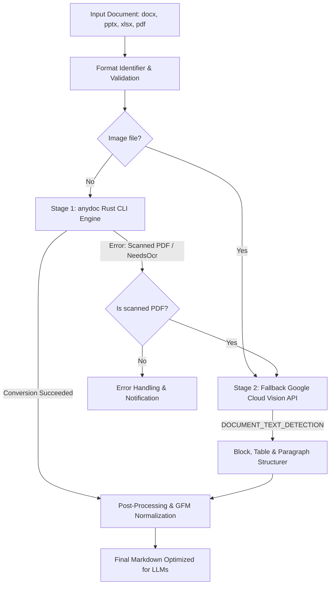
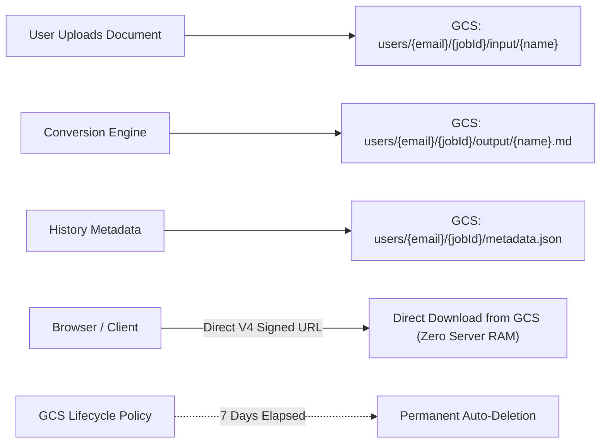
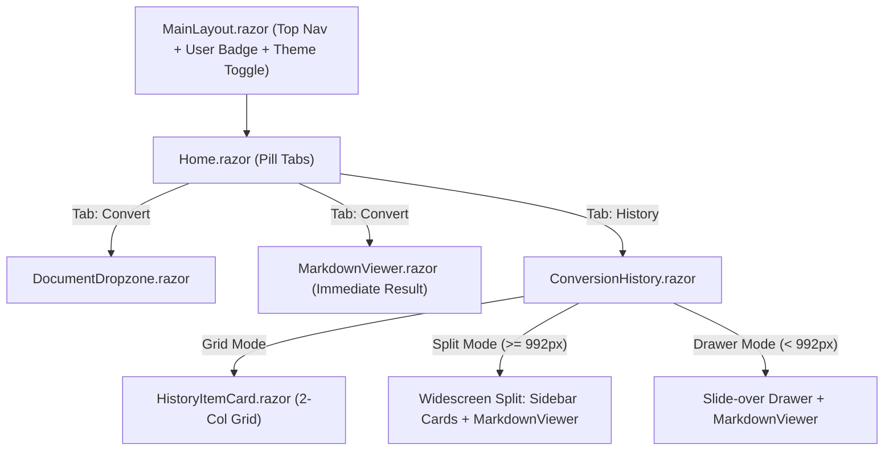
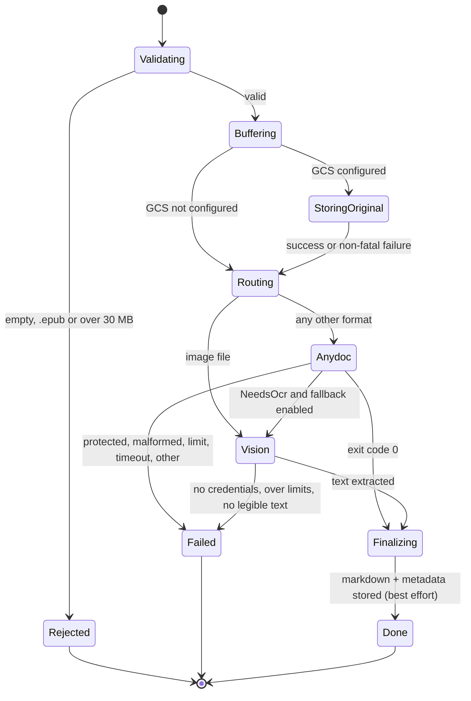
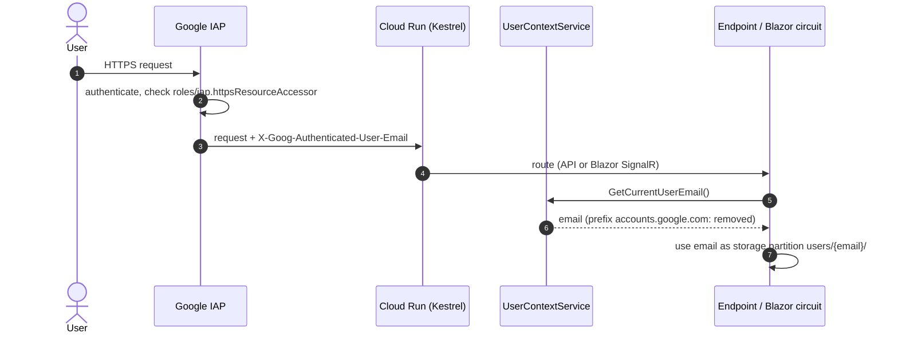
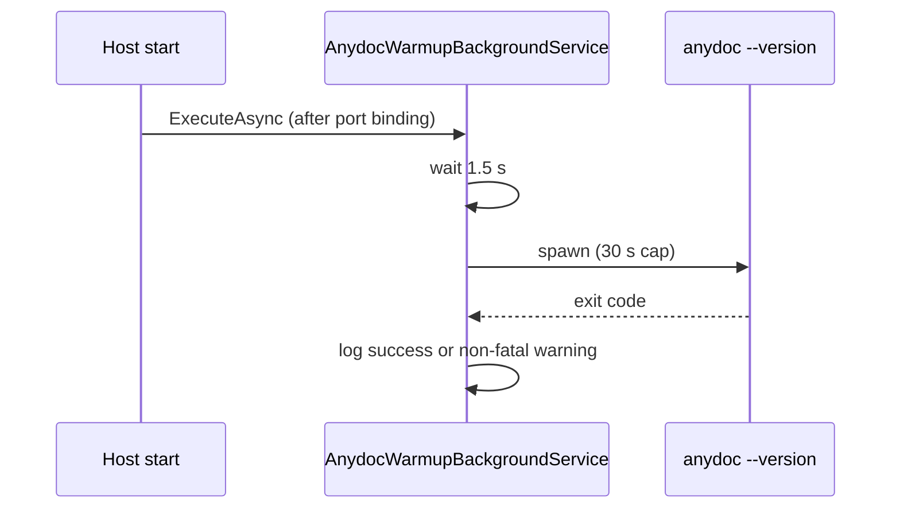
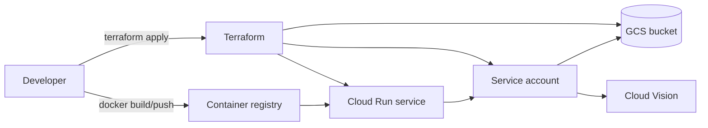

# Technical Architecture - DocumentMDConverter

## 1. Overview
**DocumentMDConverter** is a unified monolithic application based on **ASP.NET Core / Blazor (.NET 10)** deployed to **Google Cloud Platform (GCP)** on **Cloud Run** and managed with **Terraform**. Its purpose is to convert enterprise productivity documents (`.docx`, `.pptx`, `.xlsx`, `.csv`, `.pdf`, images) into clean, structured **Markdown (GFM)** for human review and Large Language Model (LLM) processing (Gemini, Claude, GPT).

---

## 2. Architecture Decisions

### 2.1 Unified Monolithic Approach (.NET 10)
Rather than a complex distributed microservices architecture, a modern monolithic architecture was chosen in [`src/DocumentMDConverter.Web`](file:///C:/personal.projects/MDConverter/MDAIConverter/src/DocumentMDConverter.Web):
* **Zero network latency overhead:** The Blazor UI directly accesses backend services in-process.
* **Single deployment unit:** One Docker container, one Cloud Run service.
* **Simplified maintenance:** The entire solution is managed within a single .NET solution [`DocumentMDConverter.slnx`](file:///C:/personal.projects/MDConverter/MDAIConverter/DocumentMDConverter.slnx) and modular Terraform environment in [`infra/`](file:///C:/personal.projects/MDConverter/MDAIConverter/infra).

### 2.2 Two-Stage Conversion Strategy (anydoc + Cloud Vision)
The conversion engine operates under a graceful fallback execution pattern:

1. **Stage 1 (anydoc - Native Rust Engine):**
   - Handles 95%+ of incoming documents: Word (`.docx`), PowerPoint (`.pptx`), Excel/Sheets (`.xlsx`, `.csv`, `.ods`), and digital PDFs with selectable text layers.
   - Executed directly from C# (.NET 10) via low-latency subprocess calls with warmup optimization (`AnydocWarmupBackgroundService`).
   - Throughput: 10 to 50 milliseconds per standard document. API cost: **$0.00**.

2. **Stage 2 (Google Cloud Vision API - Official .NET SDK):**
   - Triggered when `anydoc` returns the `NeedsOcr` flag or exit code 3 (scanned PDFs, rasterized documents) and `EnableOcrFallback` is true; **standalone image files skip `anydoc` and go straight to Vision**.
   - Inline limits: PDFs up to 10 MB / 5 pages, images up to 20 MB.
   - Utilizes Google's official library: `Google.Cloud.Vision.V1`.
   - Performs `DOCUMENT_TEXT_DETECTION` (dense document text detection with page, block, paragraph, symbol, and table hierarchies).
   - Generates structured Markdown preserving reading order and heading levels.
   - Cost: **1,000 pages per month FREE** under GCP's permanent free tier.

---

## 3. Storage & History Architecture (Serverless GCS)

To eliminate the operational complexity and financial overhead of managing a relational database (Cloud SQL) or NoSQL database (Firestore), **DocumentMDConverter** uses Google Cloud Storage as a serverless, self-purging persistence tier:

### 3.1 Object Naming Hierarchy
All objects are partitioned by sanitized user email (retrieved via Google Identity-Aware Proxy) and unique `jobId` GUID:
* `users/{sanitized_email}/{jobId}/input/{fileName}`: Raw input document.
* `users/{sanitized_email}/{jobId}/output/{markdownFileName}.md`: Converted Markdown output.
* `users/{sanitized_email}/{jobId}/metadata.json`: Serialized `ConversionHistoryItem` record containing metrics, timestamp, engine used, and storage paths.

### 3.2 Direct V4 Signed URLs (Zero RAM Streaming)
* When downloading documents or `.md` files, the application generates a **Google Cloud Storage V4 Signed URL** valid for 1 hour.
* The `/api/history/download` endpoint responds with an HTTP `302 Found` redirecting the browser directly to storage.googleapis.com.
* **Benefit:** Eliminates server-side byte buffer streaming through ASP.NET Core memory, allowing Cloud Run instances to handle high concurrent traffic with minimal RAM footprint.

### 3.3 Automatic 7-Day Auto-Purge
* Configured via Terraform in `infra/modules/storage`:
  - `lifecycle_rule.action.type = "Delete"` with `age = 7`.
  - `retention_duration_seconds = 0` (soft delete disabled).
* Ensures customer privacy, enterprise compliance, and zero storage accumulation cost.

---

## 4. User Identity & Authentication (Google IAP)

The application integrates natively with **Google Cloud Identity-Aware Proxy (IAP)**:
* Service: [`UserContextService`](file:///C:/personal.projects/MDConverter/MDAIConverter/src/DocumentMDConverter.Web/Services/UserContextService.cs) implementing [`IUserContextService`](file:///C:/personal.projects/MDConverter/MDAIConverter/src/DocumentMDConverter.Application/Interfaces/IUserContextService.cs).
* Reads the verified identity header `X-Goog-Authenticated-User-Email` injected by IAP.
* Strips Google's internal namespace prefix (`accounts.google.com:`).
* Falls back to `HttpContext.User.Identity.Name`, then to `Iap:DefaultDevUserEmail` (default `local.development@example.com`) for local development. Storage paths use `anonymous` only when no email is available.
* Controls access at the infrastructure level via IAM binding `roles/iap.httpsResourceAccessor` in Terraform.

---

## 5. UI/UX & Component Architecture

* **Pill Navigation Tabs:** Seamlessly toggle between "Convert" and "Recent Conversions".
* **Widescreen Split View (Desktop $\ge$ 992px):**
  - Left column (380px): *Sticky* scrollable list of recent conversion cards. Active card highlighted with visual outline and "Viewing Now" badge.
  - Right column (1fr): Complete [`MarkdownViewer`](file:///C:/personal.projects/MDConverter/MDAIConverter/src/DocumentMDConverter.Web/Components/Shared/MarkdownViewer.razor) with Preview, Split, and Raw tabs, token count, word count, copy, download, and close button.
  - Inspect historical conversions without ever leaving the History tab.
* **Slide-over Drawer (Mobile $<$ 992px):**
  - Smooth slide-in panel with backdrop blur (`backdrop-filter: blur(3px)`) for compact screens.

---

## 6. System Layering (Clean Architecture)

* **`DocumentMDConverter.Domain`:**
  - `ConversionModels.cs`: `ConversionRequest`, `ConversionResult`, `ConversionProgress`, `ConversionHistoryItem`, and `FormatUtils`.
  - `Common/Result.cs`: Functional `Result` and `Result<TValue>` struct with native `.Match()` methods.
  - `Common/Error.cs`: Domain error representation (`Code`, `Description`, `Type`).
* **`DocumentMDConverter.Application`:**
  - `Interfaces/`: `IDocumentConverterService`, `ICloudStorageService`, `IMarkdownRendererService`, `IAnydocEngineService`, `IGoogleVisionOcrService`, `IUserContextService`.
  - `Services/`: `DocumentConverterService` orchestrating anydoc + OCR fallback + GCS upload.
* **`DocumentMDConverter.Infrastructure`:**
  - `Engines/AnydocEngineService.cs`: Subprocess execution of `anydoc` CLI with cross-platform Linux/Windows support.
  - `Engines/GoogleVisionOcrService.cs`: Google Cloud Vision `DOCUMENT_TEXT_DETECTION` integration.
  - `Storage/GoogleCloudStorageService.cs`: Storage client with V4 Signed URL generation and metadata serialization.
  - `Warmup/AnydocWarmupBackgroundService.cs`: Background worker pre-initializing anydoc upon container startup.
* **`DocumentMDConverter.Web`:**
  - `Components/`: Blazor Server components (`Home.razor`, `DocumentDropzone.razor`, `MarkdownViewer.razor`, `ConversionHistory.razor`, `HistoryItemCard.razor`).
  - `Endpoints/`: Minimal API endpoints (`ConvertDocumentEndpoint.cs`, `ConversionHistoryEndpoint.cs`, `BatchZipEndpoint.cs`, `HealthCheckEndpoint.cs`), auto-registered by reflection over `IEndpoint`.
  - `Infrastructure/`: `CustomResults.cs` mapping domain errors to RFC 7807 Problem Details.

---

## 7. Supported Formats Matrix

| Category | Extensions | Primary Engine | Fallback Engine | Output Format |
| :--- | :--- | :--- | :--- | :--- |
| **Documents** | `.docx`, `.doc`, `.odt`, `.rtf` | `anydoc` (Rust) | N/A | Clean Markdown (Headings, Lists, Bold, Italic) |
| **Spreadsheets** | `.xlsx`, `.xls`, `.csv`, `.ods` | `anydoc` (Rust) | N/A | GFM Tables (`\| Col 1 \| Col 2 \|`) |
| **Presentations**| `.pptx`, `.ppt`, `.odp` | `anydoc` (Rust) | N/A | Slide Markdown separated by horizontal rules (`---`) |
| **PDF (Digital)**| `.pdf` (selectable text) | `anydoc` (Rust) | N/A | Preserved paragraphs, headers, and tables |
| **PDF (Scanned)**| `.pdf` (scanned images) | `anydoc` (detects OCR need) | **Google Cloud Vision OCR** | High-density optical text detection |
| **Images** | `.png`, `.jpg`, `.jpeg`, `.webp`, `.tiff`, `.tif`, `.bmp` | **Google Cloud Vision OCR** (routed directly, `anydoc` is skipped) | N/A | Optical character recognition |

---

## 8. Runtime Behavior in Depth

### 8.1 Conversion pipeline (state machine)

The temp file `conv-{guid}_{name}` is always deleted in a `finally` block. Progress events emitted: `Upload 20%`, `Extract 55%`, `OCR 60%/75%`, then `Format 100%` by the UI.

### 8.2 Request and identity flow

### 8.3 Warm-up and cold start

On Cloud Run scale-to-zero the first request still pays container start; warm-up only removes the `npx`/binary resolution latency from the first conversion.

### 8.4 Error model

* `Result<T>` carries either a value or a typed `Error` (`Code`, `Description`, `ErrorType`).
* `ErrorType` → HTTP: Validation/Problem 400, NotFound 404, Unprocessable 422, Conflict 409, Timeout 504, Failure 500 (via `CustomResults.Problem`, RFC 7807).
* Storage errors never fail a conversion; they are logged as warnings and the result is returned without persistence.

### 8.5 Deployment view

Details of modules, variables and the release procedure are in [`infra/README.md`](../infra/README.md).

---

## 9. Non-Functional Characteristics & Known Limitations

| Area | Behavior |
| :--- | :--- |
| Limits | 30 MB upload, 20 files per batch, 35 MB Kestrel/SignalR buffers, `anydoc` 60 s timeout, Vision PDF 10 MB / 5 pages, images 20 MB |
| Concurrency | Batches are processed sequentially per user circuit; Cloud Run `max_instances` caps scale (dev 2, prod 10) |
| Memory | 1 GiB per instance shared by app, `anydoc` and in-memory ZIP generation |
| Retention | 7 days (metadata `ExpiresAt` + bucket lifecycle rule) |
| Security | Access gated by IAP; secrets are never stored (ADC and service account); Mermaid runs with `securityLevel: strict`; raw HTML is disabled in the Markdown playground |
| Known gap | History `path` query parameters are not checked against the caller's `users/{email}/` prefix; rely on IAP scope and unguessable job IDs, or add a prefix check |
| Known gap | ZIP creation buffers the archive in memory |
| Dependency | Mermaid is loaded from a public CDN at runtime |
